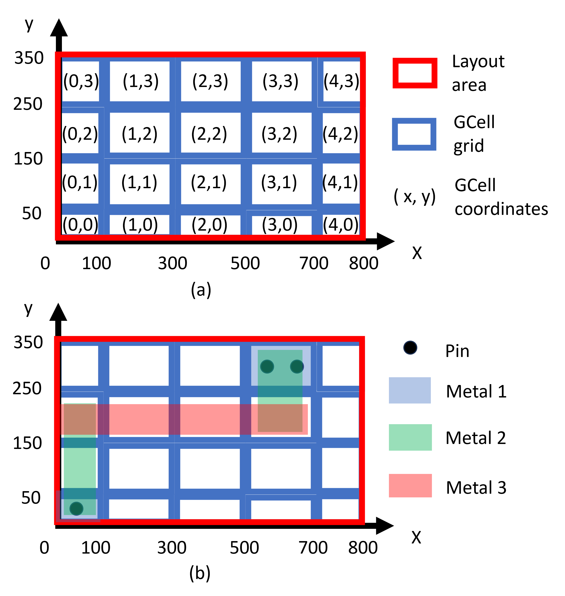

# ISPD24 Contest: GPU/ML-Enhanced Large Scale Global Routing

### Contest Introduction

Global routing plays a pivotal role in the VLSI design flow as it significantly impacts the timing, power, and routability of a circuit. Moreover, the efficiency of global routing is of great importance, since faster global routing can significantly enhance both the runtime and the quality of routability-driven placement algorithms.

Over the past decade, GPU accelerated computing platforms have been evolving into highly versatile and programmable systems capable of delivering immense parallel computing power. Recent studies have successfully leveraged GPUs to achieve over a 10x acceleration in global routing without compromising performance. Furthermore, machine learning (ML) techniques have been integrated into the global routing process, leading to enhanced routing solution quality.

The goal of the contest is to spur academic research for developing GPU/ML-enhanced global router for industrial-level circuits. 
Notably, contemporary VLSI circuits frequently encompass more than 50 million cells, in stark contrast to prior global routing competitions which have traditionally concentrated on scenarios involving no more than 1 million cells. By igniting interest and innovation within the global routing research community, this competition aspires to yield substantial reductions in global routing runtime for these expansive industrial-grade circuits, leveraging the computational prowess of GPUs and the potential of machine learning techniques. Concomitantly, it endeavors to elevate the overall quality of routing outcomes.

### Input/Output Format

The design and technology specifications are presented in the widely used standard LEF/DEF format. The DEF file also specifies dimensions and locations of GCells. A typical GCell dimension is $15\times 15$ M2 tracks. To successfully extract the relevant design and technology details, teams will be required to parse information from both the LEF and DEF files. For assistance in this process, a helpful starting point is the LEF/DEF parser here: https://si2.org/oa-tools-utils-libs/. 

Here is an example of GCell definition:

{
   
        CGELLGRID X 700 DO 2 STEP 100;
     
        CGELLGRID X 100 DO 4 STEP 200;
    
        CGELLGRID X 0 DO 2 STEP 100;

        CGELLGRID Y 50 DO 4 STEP 100;

        CGELLGRID Y 0 DO 2 STEP 50;

}
\Cref{fig:GR_sol} (a) illustrates the GCell definition along with the methodology for defining GCell coordinates.

The output will be the GCell-based routing solution file. Here is an illustrative example of a global routing solution for a net (as depicted in \Cref{fig:GR_sol} (b)):

Net0

{

         0 0 1 1 metal1

         0 0 1 3 metal2

         0 2 4 3 metal3

         3 2 4 4 metal2

         3 3 4 4 metal1

}

The global routing solution is described in the GCell coordinate system. And the routing solution is defined on metal (routing) layers, from which via utilization can be inferred.
In the above example, five wires are defined for Net0, each covers one or multiple contiguous GCells. And "0 2 4 3 Metal3" represents a wire cover GCells (0,2), (1,2), (2,2) and (3,2) on metal 3.
The total wire length of this routing solution is calculated by summing up the wire length on all metal layers:

         WL_M1 = (50) + (100) = 150,

         WL_M2 = (25 + 100 + 50) + (50 + 50) = 275,

         WL_M3 = 50 + 200 + 200 + 100 = 550,

         Total_WL = WL_M1 + WL_M2 + WL_M3 = 975.

This routing solution necessitates the use of four vias, comprising two vias transitioning from metal 1 to metal 2, and an additional two vias from metal 2 to metal 3.

To be considered valid, a global routing solution for a net must ensure that all pins of the net are covered by its wires, and the wires collectively form a connected graph. In this graph representation, each wire corresponds to a vertex. An edge exists between two vertices (wires) if they satisfy either of the following conditions: (i) they touch each other on the same metal layer, or (ii) they reside on neighboring metal layers and have a non-zero overlapping area. The resulting graph must be a connected structure. For an overall global routing solution to be deemed valid, it must satisfy the validity criteria for all nets in the circuit.

Figure 1 Example of GCell definition and global routing solution. (a) shows an example of GCell definition; (b) depicts a global routing solution.

### Anouncement
- Registration opens on Sep 11, 2023!
- Released the first set of benchmarks on Sep 11, 2023
- Released the docker for environment setup on Sep 11, 2023

### Registration

- Please fill in this online registration form: (https://form.jotform.com/232454622032143)
- Registration window: Sep 11, 2023 - Oct 15, 2023

### Important Dates

- Registration Open: Sep 11, 2023
- Registration Close: Oct 15, 2023
- Alpha Submission: TBA
- Beta Submission: TBA
- Final Submission: TBA
- Results Anouncement: March 13, 2024

### Downloads
- Introduction of the contest: (https://drive.google.com/file/d/111_a2kObt3tcjj1IQFXMCNCpQwPyBlZs/view?usp=sharing)
- First set of benchmarks with Nangate45 technology node: (https://drive.google.com/drive/folders/1afrsbeS_KuSeHEVfuQOuLWPuuZqlDVlw?usp=sharing)
- Docker for environment setup: (nvcr.io/nvidian/research/ispd24:v0)
  
### Q&A

- Please post your questions in GitHub Issues

### Contact

- Email：ispd2024contest@gmail.com

### Sponsor
 - Sponsored by NVIDIA
   

